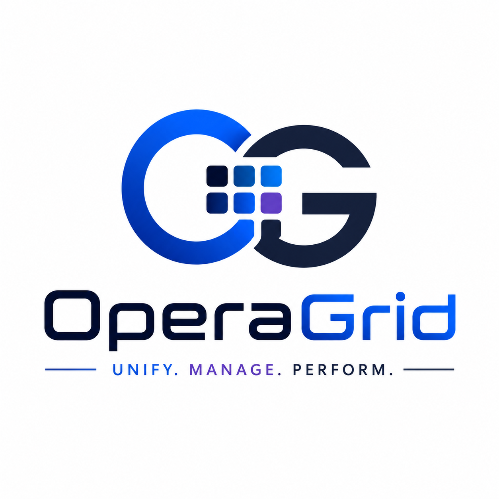
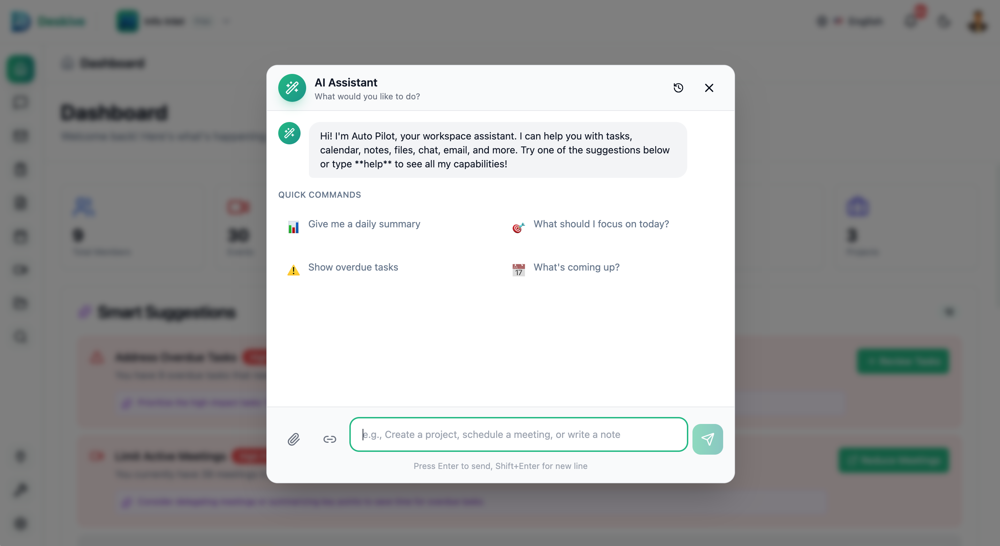
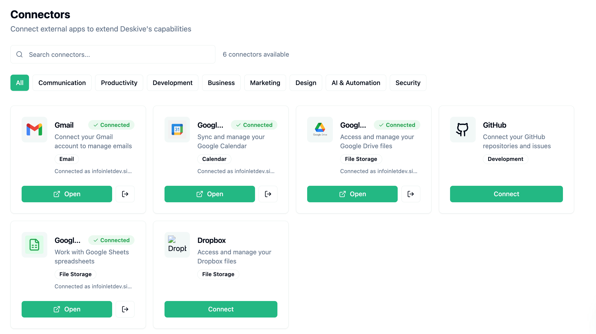

<p align="center">
  <a href="https://operagrid.com">
    
  </a>
</p>

<p align="center">
  <h1 align="center">OperaGrid</h1>
  <p align="center">
    <strong>Plataforma de colaboração em workspace de código aberto</strong>
  </p>
  <p align="center">
    Chat em tempo real, videochamadas, gerenciamento de projetos, compartilhamento de arquivos, calendário, notas, ferramentas de IA -- tudo em um só lugar.
  </p>
</p>

<p align="center">
  <a href="https://github.com/Billymcokello24/operagrid/blob/main/LICENSE"></a>
  <a href="https://github.com/Billymcokello24/operagrid/stargazers"></a>
  <a href="https://github.com/Billymcokello24/operagrid/issues"></a>
  <a href="https://github.com/Billymcokello24/operagrid/pulls"></a>
</p>

<p align="center">
  <a href="https://operagrid.com">Website</a> |
  <a href="#início-rápido">Início Rápido</a> |
  <a href="https://github.com/Billymcokello24/operagrid/discussions">Discussões</a> |
  <a href="CONTRIBUTING.md">Contribuindo</a>
</p>

<p align="center">
  <a href="./README.md">🇬🇧 English</a> |
  <a href="./README_JA.md">🇯🇵 日本語</a> |
  <a href="./README_ZH.md">🇨🇳 中文</a> |
  <a href="./README_KO.md">🇰🇷 한국어</a> |
  <a href="./README_ES.md">🇪🇸 Español</a> |
  <a href="./README_FR.md">🇫🇷 Français</a> |
  <a href="./README_DE.md">🇩🇪 Deutsch</a> |
  <strong>Português</strong> |
  <a href="./README_RU.md">🇷🇺 Русский</a> |
  <a href="./README_HI.md">🇮🇳 हिन्दी</a> |
  <a href="./README_AR.md">🇸🇦 العربية</a>
</p>

---

## O que é OperaGrid?

OperaGrid é uma **plataforma de colaboração em workspace auto-hospedável** que reúne comunicação em tempo real, gerenciamento de projetos e ferramentas de produtividade. Construída para equipes que desejam controle completo sobre seus dados, o OperaGrid oferece funcionalidades do Slack + Notion + Zoom + Asana em uma única aplicação de código aberto.

Diferentemente do Slack que requer planos pagos para videochamadas ou do Notion que não possui chat em tempo real, o OperaGrid oferece tudo que você precisa para colaborar efetivamente -- chat, videochamadas, quadros de projetos, compartilhamento de arquivos, assistência de IA -- sem aprisionamento de fornecedor ou licenciamento proprietário.

<p align="center">
  
  <br>
  <em>Painel de workspace do OperaGrid com comunicação e gerenciamento de projetos integrados</em>
</p>

### Como Funciona

1. **Crie Seu Workspace** -- Configure workspaces de equipe com canais, projetos e funções personalizadas
2. **Comunique-se em Tempo Real** -- Chat com threads, reações, menções, GIFs e videochamadas HD
3. **Gerencie Projetos** -- Organize trabalho com quadros Kanban, sprints, dependências de tarefas e controle de tempo
4. **Colabore em Documentos** -- Compartilhe notas, quadros brancos, arquivos com controle de versão e assinaturas digitais
5. **Automatize com IA** -- O AutoPilot tem acesso total a todo o aplicativo e pode automatizar tudo -- agendamento, mensagens, atualizações de projetos e mais
6. **Receba Sugestões Inteligentes** -- A IA analisa seus dados e sugere tarefas, ações e prioridades diretamente do painel

### Capacidades Principais

- **💬 Comunicação em Tempo Real** -- Canais, mensagens diretas, threads, reações, menções e suporte a GIF
- **📹 Videoconferência HD** -- Videochamadas integradas com compartilhamento de tela, gravação e transcrição via LiveKit
- **📋 Gerenciamento de Projetos** -- Quadros Kanban, sprints, marcos, dependências de tarefas e controle de tempo
- **📁 Gerenciamento de Arquivos** -- Armazenamento em nuvem com versionamento, compartilhamento e integração com Google Drive
- **📝 Notas Colaborativas** -- Editor baseado em blocos com colaboração em tempo real e templates
- **📅 Calendário e Agendamento** -- Gerenciamento de eventos, eventos recorrentes, salas de reunião e rastreamento de disponibilidade
- **🎨 Quadro Branco** -- Workspace de colaboração visual para brainstorming e planejamento
- **🤖 Agente IA AutoPilot** -- Assistente de IA totalmente autônomo com acesso a todo o aplicativo -- automatiza tarefas, agenda reuniões, envia mensagens, gerencia projetos e lida com fluxos de trabalho em todos os módulos
- **🧠 Sugestões Inteligentes** -- Sugestões do painel alimentadas por IA que analisam sua atividade, projetos e prazos para recomendar tarefas e prioridades
- **🧰 Ferramentas Integradas** -- Ferramentas de produtividade prontas para uso para tarefas diárias -- enquetes, lembretes, controle de tempo, templates e mais -- sem configuração adicional
- **🔌 Conectores** -- Mais de 180 conectores de aplicativos de terceiros com mais de 6 integrações OAuth pré-configuradas incluindo Slack, Google Drive, GitHub, Dropbox, Gmail e mais
- **📊 Formulários e Análises** -- Construtor de formulários personalizados com rastreamento de respostas e métricas de workspace
- **✅ Fluxos de Aprovação** -- Sistema de aprovação integrado para documentos e processos
- **💰 Rastreamento de Orçamento** -- Gerenciamento de despesas, taxas de cobrança e monitoramento de orçamento
- **🔍 Busca Semântica** -- Busca alimentada por IA em todos os tipos de conteúdo
- **🌍 Internacionalização** -- Suporte multilíngue (Inglês, Japonês, expansível)

### Destaques de Funcionalidades

<p align="center">
  <strong>🤖 Agente IA AutoPilot</strong><br>
  <em>Assistente de IA totalmente autônomo com acesso a todo o aplicativo -- pergunte qualquer coisa, automatize tudo</em><br><br>
  
</p>

<p align="center">
  <strong>🧠 Sugestões Inteligentes</strong><br>
  <em>A IA analisa sua atividade e prazos para recomendar tarefas e prioridades diretamente do painel</em><br><br>
  
</p>

<p align="center">
  <strong>🧰 Ferramentas Integradas</strong><br>
  <em>Ferramentas de produtividade prontas para uso -- construtor de documentos, bots, orçamentos, quadros brancos, formulários e mais</em><br><br>
  
</p>

<p align="center">
  <strong>🔌 Conectores</strong><br>
  <em>180+ conectores de apps de terceiros com OAuth pré-configurado para Gmail, Google Calendar, Drive, GitHub, Dropbox e mais</em><br><br>
  
</p>

## Qual Problema Resolvemos

### O Dilema da Fragmentação de Ferramentas de Colaboração

Equipes modernas fazem malabarismos com múltiplas assinaturas: Slack para chat ($8,75/usuário/mês), Zoom para vídeo ($15,99/usuário/mês), Asana para projetos ($10,99/usuário/mês), Notion para documentos ($10/usuário/mês). Isso cria fluxos de trabalho fragmentados, silos de dados, riscos de segurança de múltiplos fornecedores e custos que escalam linearmente com o tamanho da equipe.

**Pontos problemáticos comuns que abordamos:**

- ❌ **Fragmentação de Ferramentas** -- Alternar entre mais de 5 ferramentas diariamente interrompe o foco e a produtividade
- ❌ **Custos Crescentes** -- Assinaturas SaaS somam mais de $50/usuário/mês para colaboração básica
- ❌ **Aprisionamento de Dados** -- Seus dados vivem nos servidores de outra pessoa com opções de exportação limitadas
- ❌ **Preocupações com Privacidade** -- Dados comerciais sensíveis compartilhados com múltiplos fornecedores terceirizados
- ❌ **Complexidade de Integração** -- Cada ferramenta requer integrações e autenticação de API separadas
- ❌ **Lacunas de Recursos** -- Nenhuma plataforma única oferece recursos abrangentes de colaboração

### Solução do OperaGrid

✅ **Plataforma Tudo-em-Um** -- Chat, vídeo, projetos, arquivos, calendário, notas e IA em uma aplicação

✅ **Auto-Hospedado e Código Aberto** -- Propriedade completa dos dados com licença GNU AGPL 3.0

✅ **Zero Custos por Usuário** -- Um custo de infraestrutura independentemente do tamanho da equipe

✅ **Integração Profunda** -- Todos os recursos compartilham contexto e dados perfeitamente

✅ **Pronto para Empresa** -- Assinaturas digitais, fluxos de aprovação, logs de auditoria e suporte SSO

## Por que OperaGrid? (Comparação)

| Recurso | OperaGrid | Slack | Notion | Asana | Microsoft Teams |
|---------|---------|-------|--------|-------|-----------------|
| **Chat em Tempo Real** | ✅ Canais, threads, reações | ✅ | ⚠️ Apenas comentários | ⚠️ Apenas comentários | ✅ |
| **Videochamadas** | ✅ HD, gravação, transcrição | ⚠️ Huddles (básico) | ❌ | ❌ | ✅ |
| **Gerenciamento de Projetos** | ✅ Kanban, sprints, dependências | ❌ | ⚠️ Quadros básicos | ✅ Completo | ⚠️ Planner |
| **Gerenciamento de Arquivos** | ✅ Versionamento, compartilhamento, sincronização Drive | ⚠️ Uploads básicos | ⚠️ Incorporado | ⚠️ Anexos | ✅ SharePoint |
| **Notas e Documentos** | ✅ Editor de blocos, colab. em tempo real | ⚠️ Canvas (básico) | ✅ Completo | ❌ | ⚠️ Loop |
| **Calendário** | ✅ Eventos, salas, disponibilidade | ❌ | ❌ | ⚠️ Visualização timeline | ✅ |
| **Quadro Branco** | ✅ Workspace colaborativo | ❌ | ❌ | ❌ | ✅ |
| **Assistente de IA** | ✅ AutoPilot, intel. de reuniões | ⚠️ Resumo | ⚠️ Escrita | ⚠️ Status | ✅ Copilot |
| **Construtor de Formulários** | ✅ Formulários personalizados com análises | ❌ | ❌ | ✅ | ✅ |
| **Rastreamento de Orçamento** | ✅ Despesas, cobrança, orçamentos | ❌ | ❌ | ❌ | ❌ |
| **Fluxos de Aprovação** | ✅ Sistema integrado | ⚠️ Workflow Builder | ❌ | ✅ | ✅ Power Automate |
| **Automação de Bot** | ✅ Bots personalizados, gatilhos/ações | ✅ Bolt SDK | ❌ | ⚠️ Regras | ✅ Power Automate |
| **Integração de Email** | ✅ Gmail OAuth, SMTP/IMAP | ❌ | ❌ | ⚠️ Email para tarefa | ✅ Outlook |
| **Auto-Hospedado** | ✅ Docker Compose | ❌ | ❌ | ❌ | ❌ |
| **Código Aberto** | ✅ GNU AGPL 3.0 | ❌ | ❌ | ❌ | ❌ |
| **Apps Desktop** | ✅ Tauri (Mac, Win, Linux) | ✅ Electron | ✅ Electron | ❌ | ✅ Electron |
| **Curva de Aprendizado** | 🟢 Baixa | 🟢 Baixa | 🟡 Média | 🟡 Média | 🔴 Alta |
| **Preços** | 🟢 Grátis (auto-hospedado) | 💰 $8,75/usuário/mês | 💰 $10/usuário/mês | 💰 $10,99/usuário/mês | 💰 $4/usuário/mês |

### O que Torna o OperaGrid Único?

1. **Plataforma Verdadeiramente Unificada** -- Todos os recursos compartilham o mesmo modelo de dados, permitindo integração profunda impossível com ferramentas separadas
2. **Auto-Hospedagem Sem Compromissos** -- Paridade completa de recursos com alternativas SaaS, incluindo videochamadas e IA
3. **Stack Tecnológico Moderno** -- Construído com React 19, NestJS 11 e TypeScript para manutenibilidade e desempenho
4. **Design Nativo de IA** -- Busca vetorial, memória de conversação e agente AutoPilot integrados na plataforma central
5. **Escalabilidade Econômica** -- Um custo de infraestrutura serve usuários ilimitados, diferente de preços por assento SaaS

## 📊 Atividade do Projeto e Estatísticas

OperaGrid é um projeto **ativamente mantido** com uma comunidade crescente. Veja o que está acontecendo:

### Atividade no GitHub

<p align="left">
  
  
  
  
</p>

<p align="left">
  
  
  
  
</p>

### Métricas da Comunidade

| Métrica | Status | Detalhes |
|--------|--------|---------|
| **Total de Contribuidores** |  | Comunidade crescente de desenvolvedores pelo mundo |
| **Total de Commits** |  | Desenvolvimento ativo desde o início |
| **Commits Mensais** |  | Atualizações e melhorias regulares |
| **Qualidade do Código** |  | TypeScript, ESLint, Prettier aplicados |
| **Documentação** |  | Guias detalhados e documentação de API |

### Estatísticas de Linguagem e Código

<p align="left">
  
  
  
  
</p>

### Destaques de Atividade Recente

- ✅ **Mais de 40 Módulos** -- API backend abrangente com arquitetura modular
- ✅ **148 Tabelas de Banco de Dados** -- Schema pronto para produção com migrações
- ✅ **Videoconferência HD** -- Integração LiveKit com gravação e transcrição
- ✅ **IA AutoPilot** -- Agente de IA totalmente autônomo com acesso a todo o aplicativo para automação de tarefas de ponta a ponta
- ✅ **Sugestões Inteligentes** -- Painel alimentado por IA que analisa dados do usuário para recomendar tarefas e prioridades
- ✅ **180+ Conectores** -- Integrações de aplicativos de terceiros com OAuth pré-configurado para Slack, GitHub, Google e mais
- ✅ **Suporte Multilíngue** -- i18n com Inglês e Japonês
- ✅ **Apps Desktop** -- Apps baseados em Tauri para macOS, Windows e Linux

### Por que Esses Números Importam

**Manutenção Ativa** -- Commits regulares e resposta rápida a issues mostram que o projeto é ativamente mantido e suportado

**Código Moderno** -- TypeScript em toda parte garante segurança de tipo, melhor experiência de desenvolvedor e menos erros em tempo de execução

**Pronto para Produção** -- Conjunto de recursos abrangente com mais de 40 módulos backend demonstra maturidade além do estágio MVP

**Crescimento da Comunidade** -- Base de contribuidores crescente e discussões ativas indicam engajamento saudável da comunidade

**Desenvolvimento Aberto** -- Todo desenvolvimento acontece em público com tomada de decisões transparente e roadmap

### Participe da Atividade!

Quer ver suas contribuições aqui? Confira nosso [Guia Rápido de Contribuição](#-guia-rápido-de-contribuição) abaixo!

## Início Rápido

### Docker (Recomendado)

Execute esses comandos a partir da raiz do projeto:

```bash
git clone https://github.com/Billymcokello24/operagrid.git
cd operagrid
cp .env.docker .env
# Edite .env com sua configuração (credenciais de banco de dados, chaves de API, etc.)
docker compose up -d
```

É isso! Acesse o app em `http://localhost:5175` e a API em `http://localhost:3000`.

### Configuração Manual

**Pré-requisitos:** Node.js 20+, PostgreSQL 15+, Redis 7+

```bash
# Clone
git clone https://github.com/Billymcokello24/operagrid.git
cd operagrid

# Backend
cd backend
cp .env.example .env    # Edite .env com sua configuração
npm install
npm run migrate         # Execute migrações de banco de dados
npm run start:dev

# Frontend (em um novo terminal)
cd frontend
cp .env.example .env
npm install
npm run dev
```

Frontend: `http://localhost:5175` | Backend: `http://localhost:3000`

### Início com Um Comando

Para ambientes de desenvolvimento:

```bash
./start.sh
```

## Arquitetura

```
┌─────────────────────────────────────────────────────────────┐
│                     Frontend (React 19)                     │
│  ┌──────────┐  ┌──────────┐  ┌──────────┐  ┌──────────┐     │
│  │   Chat   │  │ Projetos │  │ Arquivos │  │Calendário│     │
│  └──────────┘  └──────────┘  └──────────┘  └──────────┘     │
│         Vite + TypeScript + Tailwind CSS + Radix UI         │
└────────────────────────┬────────────────────────────────────┘
                         │ REST API + Socket.io
┌────────────────────────┴────────────────────────────────────┐
│                    Backend (NestJS 11)                      │
│  ┌──────────┐  ┌──────────┐  ┌──────────┐  ┌──────────┐     │
│  │   Auth   │  │   Chat   │  │ Tarefas  │  │    IA    │     │
│  └──────────┘  └──────────┘  └──────────┘  └──────────┘     │
│         Mais de 40 Módulos com TypeScript + SQL Puro        │
└────────┬─────────────┬─────────────┬─────────────┬──────────┘
         │             │             │             │
    ┌────┴────┐   ┌────┴────┐   ┌────┴────┐   ┌────┴────┐
    │Postgres │   │  Redis  │   │ Qdrant  │   │LiveKit  │
    │(Storage)│   │(Cache)  │   │(Vector) │   │(Vídeo)  │
    └─────────┘   └─────────┘   └─────────┘   └─────────┘
```

**Frontend** (`/frontend`) -- React 19 com Vite, TypeScript, Tailwind CSS, componentes Radix UI, Zustand para gerenciamento de estado, React Query para busca de dados

**Backend** (`/backend`) -- NestJS 11 com TypeScript, PostgreSQL com consultas SQL puras, Redis para cache e recursos em tempo real, Socket.io para conexões WebSocket

**IA e Busca** -- Qdrant para embeddings vetoriais, OpenAI para GPT-4o-mini e transcrição Whisper

**Vídeo** -- LiveKit para videochamadas HD, compartilhamento de tela, gravação e transcrição em tempo real

## Módulos de Recursos

OperaGrid vem com mais de 40 módulos integrados nestas categorias:

| Categoria | Módulos |
|----------|---------|
| **Comunicação** | Chat (canais, DMs, threads), Videochamadas (HD, gravação), Email (Gmail OAuth, SMTP/IMAP), Notificações |
| **Gerenciamento de Projetos** | Tarefas, Marcos, Sprints, Quadros Kanban, Controle de Tempo, Dependências, Etiquetas |
| **Conteúdo** | Notas (editor de blocos), Documentos (assinaturas digitais), Quadros Brancos, Gerenciamento de Arquivos (versionamento, compartilhamento) |
| **Produtividade** | Calendário (eventos, salas), Formulários (construtor, análises), Aprovações (fluxos), Orçamentos (despesas, cobrança), Ferramentas integradas (enquetes, lembretes, templates) |
| **IA e Automação** | AutoPilot (agente autônomo de todo o aplicativo), Sugestões Inteligentes (recomendações de tarefas por IA), Inteligência de Reuniões, Análise de Documentos, Bots (gatilhos, ações, agendamento) |
| **Plataforma** | Auth (OAuth, SSO), Gestão de Workspace, Funções e Permissões, Busca (semântica), Análises, 180+ Conectores (Slack, GitHub, Google, Dropbox e mais) |

[Ver documentação detalhada de recursos &rarr;](https://github.com/Billymcokello24/operagrid/wiki)

## Provedores Plugáveis

Cada serviço de backend pode ser substituído por meio de uma única variável de ambiente. Os padrões mantêm o OperaGrid executável sem credenciais de nuvem; troque por um provedor gerenciado quando estiver pronto.

| Domínio | Variável de ambiente | Provedores incluídos |
|---|---|---|
| **Armazenamento** (PR [#28](https://github.com/Billymcokello24/operagrid/pull/28)) | `STORAGE_PROVIDER` | `local-fs` (padrão), `s3`, `r2`, `minio`, `b2`, `gcs`, `azure`, `none` |
| **E-mail** (PR [#30](https://github.com/Billymcokello24/operagrid/pull/30)) | `EMAIL_PROVIDER` | `smtp`, `resend`, `sendgrid`, `postmark`, `ses`, `mailgun`, `none` |
| **Push** (PR [#31](https://github.com/Billymcokello24/operagrid/pull/31)) | `PUSH_PROVIDER` | `webpush`, `fcm`, `onesignal`, `expo`, `none` |
| **Busca** (PR [#32](https://github.com/Billymcokello24/operagrid/pull/32)) | `SEARCH_PROVIDER` | `pg-trgm` (padrão, sem infraestrutura extra), `meilisearch`, `typesense`, `none` |
| **Auth / SSO** (PR [#33](https://github.com/Billymcokello24/operagrid/pull/33)) | `AUTH_PROVIDERS` | `local`, `google`, `github`, `magic-link` (sem senha, baseado em JWT) |
| **Vídeo** | `VIDEO_PROVIDER` | `livekit`, `jitsi`, `daily`, `agora`, `whereby`, `none` |
| **IA** | `AI_PROVIDER` | `openai`, `anthropic`, `gemini`, `groq`, `ollama` (local) |

- **Busca por palavra-chave e semântica coexistem.** O `SearchProviderService` cuida da busca por trigramas/facetada; o `SearchService` continua lidando com a busca vetorial/semântica do Qdrant.
- **SDKs opcionais são carregados sob demanda** — `@azure/storage-blob`, `@google-cloud/storage`, `firebase-admin`, `livekit-server-sdk` e `agora-token` são `optionalDependencies`, portanto escolher `local-fs` / `smtp` / `webpush` / `pg-trgm` não adiciona nenhum custo de instalação.
- **Smoke tests** são enviados com cada adaptador (`backend/scripts/smoke-test-*-providers.ts`) — 27 / 45 / 61 / 55 / 37 asserções para armazenamento / e-mail / push / busca / auth respectivamente, todas passando.
- **Documentação completa:** veja `backend/docs/providers/` para variáveis de ambiente e configuração por provedor.

## i18n

OperaGrid suporta múltiplos idiomas via react-i18next:

- Inglês (en), Japonês (ja)

Quer adicionar um novo idioma? Contribua com traduções em `frontend/src/i18n/locales/`. Veja o [guia de tradução](CONTRIBUTING.md).

## 🚀 Por que Contribuir com o OperaGrid?

OperaGrid é mais do que apenas mais um projeto de código aberto -- é uma oportunidade de construir o futuro da colaboração em equipe enquanto domina práticas modernas de desenvolvimento.

### O que Você Ganhará

**📚 Aprenda Stack Tecnológico Moderno**
- **React 19** -- React mais recente com recursos concorrentes e componentes de servidor
- **NestJS 11** -- Framework Node.js de nível empresarial com injeção de dependência
- **TypeScript em Toda Parte** -- Tipagem forte, melhor suporte de IDE, menos bugs
- **PostgreSQL + SQL Puro** -- Design de banco de dados sem mágica ORM
- **Sistemas em Tempo Real** -- Socket.io para WebSockets, Redis para pub/sub
- **Integração de IA** -- Embeddings OpenAI, busca vetorial com Qdrant

**💼 Construa Seu Portfólio**
- Contribua para uma plataforma **pronta para produção** usada por equipes no mundo todo
- Trabalhe em recursos que aparecem no seu perfil GitHub
- Obtenha reconhecimento em nosso hall da fama de contribuidores
- Construa expertise em **plataformas de colaboração** e **sistemas em tempo real** -- habilidades altamente valorizadas em 2026

**🤝 Junte-se a uma Comunidade Crescente**
- Conecte-se com desenvolvedores de todo o mundo
- Receba revisões de código de mantenedores experientes
- Aprenda melhores práticas em arquitetura de software
- Participe de discussões técnicas e decisões de design

**🎯 Cause Impacto Real**
- Seu código ajudará equipes a se libertarem de assinaturas SaaS caras
- Veja seus recursos sendo usados em ambientes de produção
- Influencie a direção de ferramentas de colaboração de código aberto

**⚡ Onboarding Rápido**
- Docker Compose te deixa pronto em **menos de 5 minutos**
- Código bem documentado com arquitetura clara
- Mantenedores amigáveis que respondem PRs em até 48 horas
- Labels "good first issue" para novatos

## 🎯 Guia Rápido de Contribuição

Comece a contribuir em **menos de 10 minutos**:

### Passo 1: Configure Seu Ambiente

```bash
# Faça fork do repositório no GitHub, depois clone seu fork
git clone https://github.com/SEU_USUARIO/operagrid.git
cd operagrid

# Inicie com Docker (jeito mais fácil)
cp .env.docker .env
docker compose up -d

# Acesse o app
# Frontend: http://localhost:5175
# API Backend: http://localhost:3000
```

**É isso!** Você está executando o OperaGrid localmente.

### Passo 2: Encontre Algo para Trabalhar

Escolha baseado no seu nível de experiência:

**🟢 Iniciante-Amigável**
- 📝 [Corrigir erros de digitação ou melhorar documentação](https://github.com/Billymcokello24/operagrid/labels/documentation)
- 🌍 [Adicionar traduções](https://github.com/Billymcokello24/operagrid/labels/i18n) -- Suportamos Inglês e Japonês
- 🐛 [Corrigir bugs simples](https://github.com/Billymcokello24/operagrid/labels/good%20first%20issue)
- ✨ [Melhorar UI/UX](https://github.com/Billymcokello24/operagrid/labels/ui%2Fux)

**🟡 Intermediário**
- 🔗 Adicionar novas integrações -- Veja nosso [Guia de Integração](backend/README.md#integrations)
- 🧪 [Escrever testes](https://github.com/Billymcokello24/operagrid/labels/tests)
- 🚀 [Melhorias de desempenho](https://github.com/Billymcokello24/operagrid/labels/performance)
- 📱 [Responsividade mobile](https://github.com/Billymcokello24/operagrid/labels/mobile)

**🔴 Avançado**
- 🤖 [Recursos de IA](https://github.com/Billymcokello24/operagrid/labels/ai) -- Melhorias AutoPilot, novas capacidades de IA
- ⚙️ [Melhorias no motor central](https://github.com/Billymcokello24/operagrid/labels/core)
- 🏗️ [Melhorias de arquitetura](https://github.com/Billymcokello24/operagrid/labels/architecture)
- 🔐 [Recursos de segurança](https://github.com/Billymcokello24/operagrid/labels/security)

### Passo 3: Faça Suas Alterações

```bash
# Crie uma nova branch
git checkout -b feature/nome-do-seu-recurso

# Faça suas alterações
# - Código backend: /backend/src/modules
# - Código frontend: /frontend/src
# - Migrações de banco de dados: /backend/migrations

# Teste suas alterações
npm test

# Commit com uma mensagem clara
git commit -m "feat: adiciona nova integração para XYZ"
```

### Passo 4: Envie Seu Pull Request

```bash
# Envie para seu fork
git push origin feature/nome-do-seu-recurso

# Abra um PR no GitHub
# - Descreva o que você mudou e por quê
# - Link para quaisquer issues relacionadas
# - Adicione screenshots se for uma mudança de UI
```

**O que acontece a seguir?**
- ✅ Testes automatizados executam no seu PR
- 👀 Um mantenedor revisa seu código (geralmente em até 48 horas)
- 💬 Podemos sugerir mudanças ou melhorias
- 🎉 Uma vez aprovado, seu código é mesclado!

### Dicas de Contribuição

✨ **Comece pequeno** -- Seu primeiro PR não precisa ser um recurso enorme

📖 **Leia o código** -- Navegue pelos módulos existentes em `backend/src/modules` como referência

❓ **Faça perguntas** -- Abra uma [Discussão no GitHub](https://github.com/Billymcokello24/operagrid/discussions) se estiver travado

🧪 **Escreva testes** -- PRs com testes são mesclados mais rápido

📝 **Documente seu código** -- Adicione comentários para lógica complexa

### Precisa de Ajuda?

- 💡 [Discussões no GitHub](https://github.com/Billymcokello24/operagrid/discussions) -- Faça perguntas, compartilhe ideias
- 📖 [Guia de Contribuição](CONTRIBUTING.md) -- Diretrizes detalhadas de contribuição
- 🐛 [Issues no GitHub](https://github.com/Billymcokello24/operagrid/issues) -- Reporte bugs ou solicite recursos

## Contribuindo

Aceitamos contribuições! Veja nosso [Guia de Contribuição](CONTRIBUTING.md) para começar.

**Formas de contribuir:**
- Reporte bugs ou solicite recursos via [Issues no GitHub](https://github.com/Billymcokello24/operagrid/issues)
- Envie pull requests para correções de bugs ou novos recursos
- Adicione novas integrações (veja o [Guia de Integração](backend/README.md#integrations))
- Melhore a documentação
- Adicione traduções

## Contribuidores

Obrigado a todas as pessoas incríveis que contribuíram para o OperaGrid! 🎉

<a href="https://github.com/Billymcokello24/operagrid/graphs/contributors">
  
</a>

Quer ver seu rosto aqui? Confira nosso [Guia de Contribuição](CONTRIBUTING.md) e comece a contribuir hoje!

## 💬 Junte-se à Nossa Comunidade

Conecte-se com desenvolvedores, obtenha ajuda e fique atualizado sobre os últimos desenvolvimentos do OperaGrid!

<p align="center">
  <a href="https://github.com/Billymcokello24/operagrid/discussions">
    
  </a>
</p>

### Onde Nos Encontrar

| Plataforma | Propósito | Link |
|----------|---------|------|
| 💡 **Discussões no GitHub** | Faça perguntas, compartilhe ideias, solicite recursos | [Iniciar Discussão](https://github.com/Billymcokello24/operagrid/discussions) |
| 🐛 **Issues no GitHub** | Relatórios de bugs, solicitações de recursos | [Abrir Issue](https://github.com/Billymcokello24/operagrid/issues) |
| 🌐 **Website** | Documentação, guias, atualizações | [operagrid.com](https://operagrid.com) |

### Diretrizes da Comunidade

- 🤝 **Seja Respeitoso** -- Trate todos com respeito e gentileza
- 💡 **Compartilhe Conhecimento** -- Ajude outros a aprender e crescer
- 🐛 **Reporte Issues** -- Encontrou um bug? Nos avise nos Issues do GitHub
- 🎉 **Celebre Vitórias** -- Compartilhe suas implementações e casos de uso do OperaGrid
- 🌍 **Pense Global** -- Somos uma comunidade mundial suportando múltiplos idiomas

## Licença

Este projeto está licenciado sob a [GNU Affero General Public License v3.0](LICENSE).

Copyright 2025 Contribuidores do OperaGrid.

## Agradecimentos

Construído com NestJS, React, PostgreSQL, Redis, TypeScript, Tailwind CSS, LiveKit, OpenAI e Qdrant.

---

<p align="center">
  <a href="https://operagrid.com">Website</a> |
  <a href="https://github.com/Billymcokello24/operagrid/wiki">Documentação</a> |
  <a href="https://github.com/Billymcokello24/operagrid/discussions">Discussões</a>
</p>

---

<p align="center">
  <strong>Construído com ❤️ pela comunidade <a href="https://github.com/operagrid">OperaGrid</a></strong>
</p>

<p align="center">
  Se você achar este projeto útil, por favor considere dar uma estrela! ⭐
  <br><br>
  <a href="https://github.com/Billymcokello24/operagrid/stargazers">
    
  </a>
</p>
